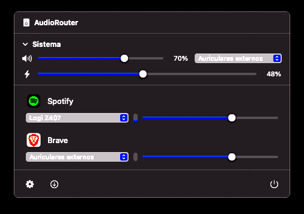

# AudioRouter

A macOS menu bar app that routes each application's audio to a different
output device — Chrome to your speakers, Spotify to your headphones, at the
same time. Free, open source, and doesn't send anything home.



**[Download the latest release →](https://audiorouter-app.vercel.app)** (also available [en español](https://audiorouter-app.vercel.app/es/))

## Why

Tools like SoundSource solve this well but are paid, and the free tier nags
you with noise every 30 minutes. AudioRouter does the one thing — per-app
output routing — for free, using Apple's own public APIs.

## Features

- **Per-app output routing** — assign any app to any connected output device.
- **Independent volume + live level meter per app.**
- **System-wide controls** — default output device, output volume, and sound
  effects volume, from the same menu.
- **Lives in the menu bar** — no Dock icon, no extra windows.
- **Signed with a Developer ID and notarized by Apple** — Gatekeeper accepts
  it with no warnings.
- **Self-updating** via [Sparkle](https://sparkle-project.org).
- **Localized** — English and Spanish, following your system language.
- **No telemetry, no accounts, no network access** beyond checking for
  updates.

## How it works

AudioRouter uses Core Audio's **Process Tap API**
(`AudioHardwareCreateProcessTap`, macOS 14.4+) to capture a specific
process's audio, then plays it back on the output device you choose through
a private Aggregate Device + IOProc passthrough. No kernel extensions, no
virtual audio drivers — just the same public API Apple introduced for this
in Sonoma 14.4.

Because Process Taps don't currently work reliably inside the App Sandbox,
AudioRouter is distributed outside the Mac App Store, signed with a
Developer ID and notarized — the same approach apps like Loopback and
SoundSource use.

## Requirements

- macOS 14.4 or later
- Apple Silicon or Intel

## Building from source

```bash
git clone https://github.com/RaidrDev/AudioRouter.git
cd AudioRouter
brew install xcodegen
xcodegen generate
open AudioRouter.xcodeproj
```

Then hit Run (⌘R) in Xcode. `project.yml` is the source of truth for the
Xcode project (via [XcodeGen](https://github.com/yonaskolb/XcodeGen)) — the
`.xcodeproj` itself isn't committed.

### First run: audio capture permission

The first time you route an app's audio, macOS will ask you to grant
"Screen & System Audio Recording" permission (System Settings → Privacy &
Security). This is a real system permission dialog, not something the app
can skip — it's what makes the audio capture possible at all.

### Releasing

`./release.sh` archives, signs, notarizes, staples, packages a `.dmg`, and
updates the Sparkle appcast in `site/`. It expects a Developer ID Application
certificate and a stored `notarytool` credentials profile — see the comments
at the top of the script.

## Contributing

Issues and pull requests are welcome. This is a side project built to scratch
a personal itch, so response times may vary, but feedback is genuinely
wanted — especially bug reports with your macOS version and the devices
involved.

## License

[MIT](LICENSE)
